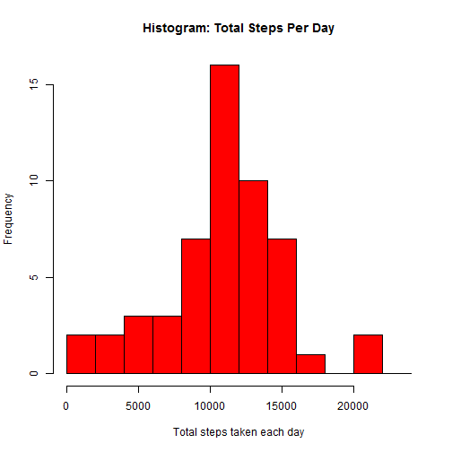
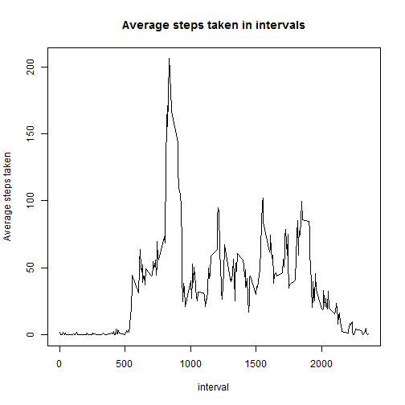
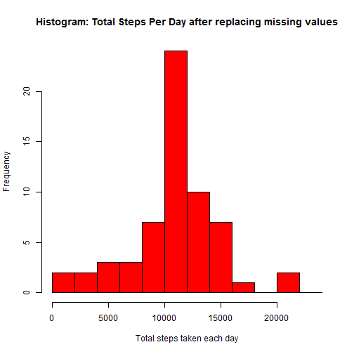
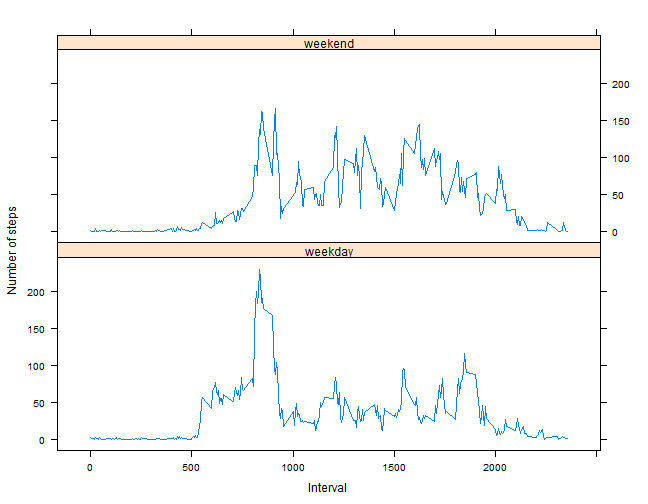

Analyzing Personal Acitivities Monitoring Data
==============================================

A personal activity monitoring device has collected data from an anonymous individual at 5 minute intervals through out the day for the months of October and November, 2012 and include the number of steps taken in each 5 minute intervals each day.

The data is availabe [here](https://d396qusza40orc.cloudfront.net/repdata%2Fdata%2Factivity.zip).

Download and unzip the data into your current directory. Then read and load the data for analysis. It assumes the file activity.csv is in current working directory.

## Loading and preprocessing the data


```r
activityData <- read.csv( "activity.csv", header = TRUE )
```

Activity data contains lots of NA values for some 5-minutes intervals. We will filter and take only available data for analysis and filter out all NAs. Also convert the date characters into appropriate date format, which will be required for analysis later.


```r
activity <- activityData[ complete.cases( activityData ), ]
activity$date <- as.Date( activity$date, "%Y-%m-%d" )
```

## What is mean total number of steps taken per day?

Let's make a histogram and find out total number of steps taken each day

```r
totalsteps <- aggregate(steps ~ date, data = activity, sum)

hist(totalsteps$steps,
     breaks = seq( 0, 25000, by = 2000 ),
     col = "red",
     main = "Histogram: Total Steps Per Day",
     xlab = "Total steps taken each day",
     ylab = "Frequency" )
```

 

What is the mean and median of steps taken each day?

```r
meanSteps <- format( mean( totalsteps$steps ), digit = 2)
message( "Mean of steps taken each day: ", meanSteps )
```

```
## Mean of steps taken each day: 10766
```

```r
medianSteps <- format( median( totalsteps$steps ), digit = 2 )
message( "Median of steps taken each day: ", medianSteps )
```

```
## Median of steps taken each day: 10765
```

## What is the average daily activity pattern?

Let's make a time series plot of the 5-minute interval and the average number of steps taken, averaged across all days.


```r
library( plyr )
agsteps <- ddply(activity, .(interval), summarize, steps=round(mean(steps), 3))
plot( agsteps$interval, agsteps$steps, 
      type = "l",
      main = "Average steps taken in intervals",
      ylab = "Average steps taken",
      xlab = "interval" )
```

 

Which 5-minute interval, on average across all the days in the dataset, contains the maximum number of steps?


```r
maxInterval <- agsteps[ agsteps$steps == max( agsteps$steps ), "interval" ]
message( "Max Steps: ", format( max( agsteps$steps ), digit = 2 )
         , " taken on day: ", maxInterval )
```

```
## Max Steps: 206 taken on day: 835
```

## Imputing missing values

There are lots of NA values for the steps taken during many intervals across various days. This may be because the data is not recorded or there are some recording errors. 

How many missing values are there in the dataset?

```r
sum( is.na( activityData ) )
```

```
## [1] 2304
```

To eliminate this, we can populate the NA values with the average steps taken during those intervals across all days. First we will find out what are the missing values. Then join with the mean steps calculated in the previous step. And then merge all the rows into a single data which contains both the original recorded data and newly populated data for missing values.

_join()_ requires _plyr_ package to be loaded into R environment. 


```r
missing <- activityData[ !complete.cases( activityData ), ]
missing <- missing[ , c( "date", "interval" ) ]
missing <- join( missing, agsteps, by = "interval", type = "left" ) 

filledData <- missing[ , c( 3, 1, 2 )] 
completeData <- rbind( activity,  filledData )
```

If we make a histogram of the new dataset and find out mean and median total number of steps taken per day.

```r
totalCompletesteps <- aggregate(steps ~ date, data = completeData, sum)

hist(totalCompletesteps$steps,
     breaks = seq( 0, 25000, by = 2000 ),
     col = "red",
     main = "Histogram: Total Steps Per Day after replacing missing values",
     xlab = "Total steps taken each day",
     ylab = "Frequency" )
```

 

The difference in mean and median values are 


```r
meanCompleteSteps <- mean( totalCompletesteps$steps )
message( "New mean after data imputation: ",  meanCompleteSteps )
```

```
## New mean after data imputation: 10766.1883278689
```

```r
medianCompleteSteps <- median( totalCompletesteps$steps )
message( "New median after data imputation: ", medianCompleteSteps )
```

```
## New median after data imputation: 10766.186
```


```r
diffMean <- meanCompleteSteps - as.numeric( meanSteps )
diffMedian <- medianCompleteSteps - as.numeric( medianSteps )

message( "Difference in mean: ", format( diffMean, digit = 2 ) )
```

```
## Difference in mean: 0.19
```

```r
message( "Difference in median: ", format( diffMedian, digit = 2) )
```

```
## Difference in median: 1.2
```

## Are there differences in activity patterns between weekdays and weekends?

Create another column in the dataset to record whether it is a weekday or weekend. weekdays() returns which day of the week it is. After that we will replace those days we weekends, which have saturdays and sundays.


```r
wdpattern <- "(.*Saturday.*|.*Sunday.*)"
idx <- grep( wdpattern, weekdays( as.Date( completeData$date, "%Y-%m-%d" ) ) )

completeData$wday <- "weekday"
completeData[ idx, "wday" ] <- "weekend"
```

Aggreating steps during various intervals across weekdays and weekends will show if there are any difference in patterns. We will make a xyplot() to show the differnce.
* _xyplot()_ requires _lattice_ package to be loaded into R environment. 


```r
weekdayVsWeekend <- ddply(completeData, .(interval, wday), summarize, steps=round(mean(steps), 3))

library( lattice )

par(mfrow = c(2, 1))
xyplot(steps ~ interval | wday, 
       data = weekdayVsWeekend,
       xlab = "Interval",
       ylab = "Number of steps",
       type = "l", 
       layout = c(1, 2))
```

 
